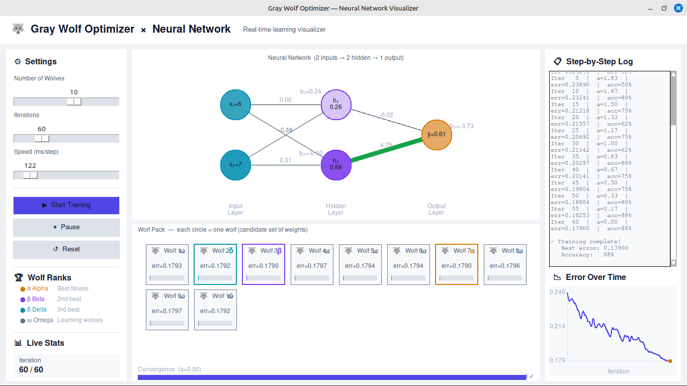

# 🐺 Gray Wolf Optimizer — Neural Network Visualizer
**youtube video:  https://youtu.be/lyNSRPqyfZM** 

A beginner-friendly desktop application that shows you **visually and in real time** how the Gray Wolf Optimizer (GWO) trains a neural network — step by step, iteration by iteration.

Built with Python, Tkinter, and NumPy. No machine learning frameworks needed.

---

## 📸 Screenshots



---

## 📋 Description

This app simulates a small neural network that learns to predict whether a student **passes or fails** based on:
- `x1` → hours studied
- `x2` → hours slept

The network has:
- **2 input neurons**
- **2 hidden neurons**
- **1 output neuron**
- **9 total parameters** (6 weights + 3 biases)

Instead of using gradient descent (normal backpropagation), the app uses the **Gray Wolf Optimizer**:

| Concept | What it means |
|---|---|
| Wolf | One candidate set of weights for the network |
| Alpha (α) | The wolf with the lowest error — the current best solution |
| Beta (β) | Second best |
| Delta (δ) | Third best |
| Omega (ω) | All other wolves — they update their weights toward α, β, δ |
| Iteration | One full round of: forward pass → rank → update weights |
| `a` value | Controls exploration. Starts at 2.0, drops to 0.0 at end |

The wolves converge over iterations until the error is minimized and training stops.

---

## ⚙️ Requirements

| Requirement | Version |
|---|---|
| Python | 3.8 or higher |
| NumPy | Any recent version |
| Tkinter | Comes built-in with Python (Windows/Mac). Linux needs one extra step. |

---

## 🚀 How to Execute

### Step 1 — Install Python

Download from [https://www.python.org/downloads](https://www.python.org/downloads)

Make sure to check **"Add Python to PATH"** during installation on Windows.

---

### Step 2 — Install NumPy

Open your terminal (Command Prompt on Windows, Terminal on Mac/Linux) and run:

```bash
pip install numpy
```

---

### Step 3 — Install Tkinter (Linux only)

On **Windows** and **Mac**, Tkinter comes with Python — skip this step.

On **Ubuntu / Debian Linux**:
```bash
sudo apt install python3-tk
```

On **Fedora / RHEL**:
```bash
sudo dnf install python3-tkinter
```

---

### Step 4 — Run the App

```bash
python gwo_nn_app.py
```

Or on some Linux systems:
```bash
python3 gwo_nn_app.py
```

---

## 🎮 How to Use the App

1. **Open the app** — you will see the main window with 3 areas
2. **Set your parameters** on the left panel:
   - `Number of Wolves` — how many candidate solutions (more = slower but better)
   - `Iterations` — how many training loops to run
   - `Speed` — delay in milliseconds between each step (lower = faster)
3. **Press ▶ Start Training** — watch everything update live
4. **Press ⏸ Pause** — freeze the simulation at any point
5. **Press ↺ Reset** — clear everything and start fresh with new settings

---

## 📁 Project Structure

```
gwo_nn_visualizer/
│
├── gwo_nn_app.py       ← Main application file (run this)
├── README.md           ← This file
└── screenshots/        ← Add your screenshots here
    ├── 01_before_training.png
    ├── 02_neural_network.png
    ├── 03_wolf_pack.png
    ├── 04_error_chart.png
    └── 05_converged.png
```

---

## 🧠 What Each Panel Shows

### Left Panel — Controls & Stats
- Sliders to configure the simulation
- Live stats: current iteration, best error, `a` value, accuracy

### Center Top — Neural Network
- Live diagram of the network
- Connection colors and thickness change as weights update
- Neuron values computed from a sample input (x1=6, x2=7)

### Center Bottom — Wolf Pack
- One card per wolf
- Rank badge (α β δ ω) updates every iteration
- Error bar shows relative fitness
- Convergence progress bar at the bottom

### Right Panel — Log & Chart
- Step-by-step text log of every iteration
- Live error curve showing the learning progress

---

## 🛑 Stop Conditions

The training stops when **any** of these happen:

1. The maximum number of iterations is reached
2. You press the **Pause** button manually
3. All wolves have fully converged (`a` reaches 0)

---

## 📜 License

Free to use for learning and educational purposes.